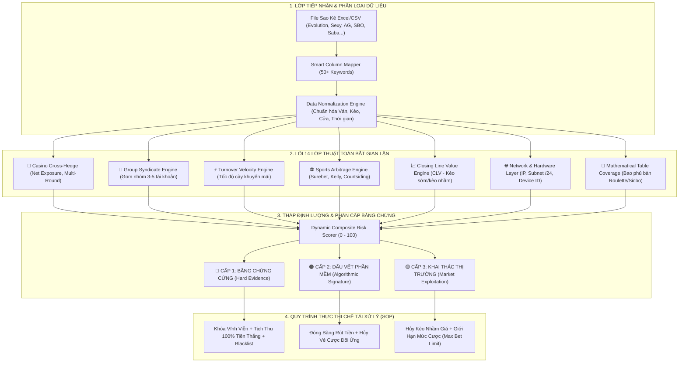

# 📋 ĐỀ ÁN KỸ THUẬT & KẾ HOẠCH TRIỂN KHAI HỆ THỐNG
## BETGUARD – HỆ THỐNG PHÁT HIỆN & XỬ LÝ GIAN LẬN ĐẶT CƯỢC ĐA TẦNG
### (Live Casino & Sportsbook Anti-Fraud & Enforcement Intelligence System)
**Phiên bản: 2.0 (Enterprise Comprehensive Edition)**  
**Định hướng trọng tâm: Vũ khí thuật toán & Quy trình thực thi chế tài gian lận triệt để**

---

> [!IMPORTANT]
> **MỤC ĐÍCH TÀI LIỆU:**  
> Tài liệu này được biên soạn dưới dạng **Đề án Kỹ thuật & Bản Kế hoạch Thẩm định Toàn diện (Technical Proposal & Fraud Enforcement Dossier)** để trình Ban Giám đốc, Hội đồng Quản trị Rủi ro (Risk & Integrity Committee) hoặc các đối tác thẩm định. Tài liệu tập trung tuyệt đối vào **Ma trận 14 lớp thuật toán bóc tách gian lận**, **Tháp phân tầng bằng chứng pháp lý**, và **Quy trình đóng băng - xử lý - tịch thu tiền cược vi phạm (Closed-Loop Enforcement SOP)**.

---

## 1. TỔNG QUAN BÀI TOÁN & TÍNH CẤP THIẾT (EXECUTIVE SUMMARY)

### 1.1. Thực trạng các thủ đoạn gian lận có tổ chức hiện nay
Trong kỷ nguyên cá cược trực tuyến đa nền tảng, các nhóm đối tượng gian lận chuyên nghiệp ("thợ cược", "trại cày", "syndicates") không còn hoạt động đơn lẻ mà tổ chức thành đường dây tinh vi nhằm rút ruột tài chính của sàn cược qua 5 thủ đoạn chính:
1. **Đánh chéo 2 đầu phân tán (Distributed Cross-Hedging):** Thay vì chỉ dùng 2 tài khoản, kẻ gian chia nhỏ nguồn vốn ra **3 đến 5 tài khoản** rải trên nhiều sàn/sảnh khác nhau, cược đối nghịch triệt tiêu rủi ro cùng một mã ván Baccarat, Sicbo, Roulette hoặc kèo bóng đá.
2. **Bào khuyến mãi & Hoàn trả siêu tốc (Turnover & Rebate Washing):** Lợi dụng chính sách hoàn trả hoa hồng (0.8% - 1.5%) hoặc gói nạp đầu, kẻ gian nạp tiền và cày hết doanh thu cược chỉ trong 15 - 30 phút bằng các vé cược triệt tiêu rủi ro rồi rút tiền ngay lập tức.
3. **Bào cỏ toán học Surebet (Arbitrage Betting):** Sử dụng phần mềm quét độ trễ tỷ lệ Odds giữa các nhà cái, tự động chia tiền cược theo tỷ lệ nghịch đảo công thức toán học để đảm bảo lợi nhuận dương bất kể kết quả trận đấu.
4. **Cược rung trễ công nghệ (Courtsiding & Micro-Latency):** Lợi dụng độ trễ từ 2 đến 7 giây của đường truyền hình ảnh trực tiếp (Live Stream/Satellite) so với dữ liệu thời gian thực tại bàn chơi hoặc sân vận động để đặt cược khi kết quả gần như đã ngã ngũ.
5. **Nuôi mạng lưới Farm Bot & Multi-Accounting:** Sử dụng các cụm máy tính cùng mạng LAN quán net, thiết bị giả lập, hoặc dải VPS để tự động cược theo kịch bản phần mềm viết sẵn.

### 1.2. Thất bại của phương pháp kiểm soát thủ công
* **Chậm trễ nghiêm trọng:** Đội ngũ Risk/Fraud mất từ 45 - 90 phút để đối soát thủ công bằng mắt trên các file Excel hàng trăm nghìn dòng, dẫn đến việc chậm trễ lệnh rút tiền của hệ thống.
* **Mù mờ trước thủ đoạn chia nhỏ tiền:** Kiểm toán thủ công chỉ nhìn vào từng vé cược đơn lẻ, hoàn toàn bất lực trước các cụm tài khoản đánh đối ứng theo nhóm.
* **Thiếu cơ sở bằng chứng đanh thép:** Khi sàn phát hiện gian lận và giữ tiền, nếu không có dữ liệu đối chiếu chính xác từng giây, từng IP và công thức toán học, sàn sẽ vấp phải khiếu nại gay gắt hoặc tranh chấp pháp lý.

### 1.3. Mục tiêu chiến lược của BetGuard
Xây dựng một **lá chắn công nghệ độc lập, tự động hóa 100% quy trình phát hiện và thực thi chế tài xử lý gian lận**, bảo đảm:
* **Tốc độ xử lý:** Phân tích 1.000.000 vé cược trong vòng dưới 30 giây.
* **Chứng cứ không thể chối cãi:** Tự động tạo lập **Hồ sơ bằng chứng vi phạm (Evidence Dossier)** chi tiết từng cặp vé, sai số thời gian mili-giây, dấu vết hạ tầng mạng (IP, Subnet, Device Fingerprint).
* **Quy trình đóng băng tự động:** Lập tức phát tín hiệu giữ lệnh rút tiền đối với các đối tượng vi phạm mức độ CRITICAL.

---

## 2. KIẾN TRÚC HỆ THỐNG & CÔNG NGHỆ (SYSTEM ARCHITECTURE)

Hệ thống được thiết kế theo nguyên lý **Phòng thủ đa tầng & Phân tích bất đồng bộ (Multi-Layered Defense & Async Processing)**:



### 2.1. Ngăn xếp công nghệ (Technology Stack)
* **Backend Engine:** Python 3.14 + FastAPI (Bất đồng bộ AsyncIO, tối ưu hóa CPU song song cho bài toán đối soát tổ hợp).
* **Xử lý ma trận dữ liệu:** Pandas, NumPy, SciPy (Kiểm định thống kê nhị thức Z-Score, phân phối siêu bội).
* **Cơ sở dữ liệu:** 
  * *Chế độ Độc lập (Standalone/On-Premise):* SQLite (Khởi chạy ngay lập tức, zero-config, phù hợp đội ngũ kiểm toán cục bộ).
  * *Chế độ Doanh nghiệp (Enterprise Scalable):* Tương thích 100% với PostgreSQL / ClickHouse cho bài toán Big Data hàng trăm triệu vé/ngày.
* **Frontend Web:** Next.js 14 (App Router) + React 18 + TailwindCSS (Giao diện Dark Mode chuyên dụng cho Security Operation Center - SOC).
* **Giám sát nội bộ:** Hệ thống **Immutable Audit Trail** (Ghi vết kiểm toán bất biến, lưu trữ nhật ký thao tác của nhân viên Risk trên chuẩn SHA-256).

---

## 3. MA TRẬN 14 LỚP THUẬT TOÁN BÓC TÁCH GIAN LẬN CHUYÊN SÂU

Hệ thống BetGuard loại bỏ hoàn toàn cảm tính, vận hành dựa trên **14 lớp kiểm định toán học, hành vi và hạ tầng mạng**:

| STT | Lớp Thuật Toán | Nguyên Lý Hoạt Động & Công Thức Toán Học | Ngưỡng Kích Hoạt | Chế Tài Xử Lý |
|:---:|---|---|---|:---:|
| **1** | **Chỉ số Triệt Tiêu Rủi Ro (Net Exposure Index)** | Đo lường tỷ lệ vốn thực tế còn chịu rủi ro: $$\text{Exposure} = \frac{|\text{Stake}_A - \text{Stake}_B|}{\text{Stake}_A + \text{Stake}_B}$$ | $\text{Exposure} < 5\%$ (Triệt tiêu $> 95\%$ rủi ro) | 🔴 **CRITICAL (Tịch thu tiền)** |
| **2** | **Cược Chéo Theo Nhóm (Group Aggregate Hedging)** | Gom cụm $N$ tài khoản ($N \ge 3$) cùng vào 1 ván/trận: $$\text{Group Exposure} = \frac{|\sum \text{Stake}_{\text{Bên 1}} - \sum \text{Stake}_{\text{Bên 2}}|}{\sum \text{Stake}_{\text{Toàn cụm}}}$$ | $\text{Group Exposure} < 5\%$ trên cụm $\ge 3$ tài khoản | 🔴 **CRITICAL (Khóa cả cụm)** |
| **3** | **Tốc Độ Cày Khuyến Mãi (Turnover Velocity Ratio - TVR)** | Đo tốc độ tạo doanh thu cược so với thời điểm nạp tiền: $$\text{TVR} = \frac{\text{Doanh số cược (Turnover)}}{\text{Số phút kể từ khi nạp tiền}}$$ | $\text{TVR} > \text{Baseline} \times 3$ kèm $\text{Exposure} < 5\%$ | 🔴 **CRITICAL (Đóng băng rút tiền)** |
| **4** | **Trùng Địa Chỉ IP Tuyệt Đối (Same IP Collision)** | 2 tài khoản đánh 2 đầu đối nghịch phát hiện cùng địa chỉ IP kết nối (cùng máy hoặc cùng mạng Wifi). | Trùng IP $100\%$ | 🔴 **CRITICAL (Khóa vĩnh viễn)** |
| **5** | **Cùng Dải Mạng Subnet (`/24`)** | Bắt các nhóm farm bot trong cùng một phòng net, văn phòng hoặc cụm máy chủ ảo VPS: `AAA.BBB.CCC.xxx`. | Trùng 3 octet đầu của IP | 🟠 **HIGH (Thẩm định khẩn)** |
| **6** | **Trùng Thiết Bị Phần Cứng (Device Fingerprint)** | Đối soát mã phần cứng `device_id`, chuỗi MAC, IMEI hoặc WebGL/Canvas Fingerprint của trình duyệt. | Trùng khớp mã thiết bị | 🔴 **CRITICAL (Khóa vĩnh viễn)** |
| **7** | **Đồng Bộ Vi Mô Tức Thời (Micro-Latency Sync)** | Đo khoảng cách thời gian $\Delta t$ giữa 2 lệnh cược ngược chiều. Bắt bot tự động bắn lệnh qua API/Extension. | $\Delta t \le 1.0\text{s}$ (Bot siêu tốc) hoặc $\le 3.0\text{s}$ | 🔴 **CRITICAL (Hủy cược vi phạm)** |
| **8** | **Dấu Vết Công Thức Surebet (Kelly / Proportional Staking)** | Bắt các vé cược chia tiền lẻ theo công thức bảo toàn lợi nhuận: $$\text{Stake}_B = \text{Stake}_A \times \frac{\text{Odd}_A}{\text{Odd}_B}$$ | Sai số tỷ lệ chia tiền $< 3\%$ | 🔴 **CRITICAL (Hủy tiền thắng)** |
| **9** | **Khai Thác Kèo Nhầm Giá (Palpable Error Exploitation)** | Phát hiện các vé cược khai thác tỷ lệ Odds nhầm lẫn nghiêm trọng từ sàn: $$1 - \left(\frac{1}{\text{Odd}_A} + \frac{1}{\text{Odd}_B}\right) > 6\%$$ | Lợi nhuận đảm bảo $> 6\%$ | 🔴 **CRITICAL (Hủy vé theo luật sàn)** |
| **10** | **Chênh Lệch Tỷ Lệ Đóng Kèo (Closing Line Value - CLV)** | So sánh tỷ lệ cược với tỷ lệ lúc đóng kèo: $$\text{CLV} = \frac{\text{Odd}_{\text{đặt}} - \text{Odd}_{\text{đóng}}}{\text{Odd}_{\text{đóng}}}$$ Bắt thợ cược chuyên nghiệp hoặc tin nội gián. | $\text{CLV} > 0$ liên tục qua $\ge 10$ trận đấu | 🟡 **MEDIUM (Hạ mức cược Max Bet)** |
| **11** | **Thông Đồng Tuyến Đại Lý (Agent / Upline Collusion)** | Hai tài khoản đánh đối ứng thuộc về cùng một mã đại lý (`agent_id`) nhằm mục đích cày hoa hồng đại lý (Affiliate Churning). | Cùng mã `agent_id` cược chéo | 🔴 **CRITICAL (Cắt hoa hồng đại lý)** |
| **12** | **Chuỗi Ván Lặp Lại (Multi-Round Persistence)** | Xây dựng ma trận tần suất cặp $(P_A, P_B)$ cược chéo nhau qua nhiều ván để loại trừ yếu tố trùng hợp ngẫu nhiên. | Lặp lại $\ge 2$ ván (Theo dõi), $\ge 5$ ván (Đường dây) | 🔴 **CRITICAL (Đưa vào Blacklist)** |
| **13** | **Bao Phủ Bàn Toán Học (Mathematical Table Coverage)** | Tính toán xác suất phủ kết quả (Roulette Đỏ+Đen, Sicbo Tài+Xỉu, Baccarat Banker+Player+Tie). | Độ bao phủ $> 90\%$ xác suất | 🔴 **CRITICAL (Không tính doanh số)** |
| **14** | **Kiểm Định Giả Thuyết Thống Kê Z-Score** | Kiểm định phân phối nhị thức trên chuỗi thắng bất thường: $$Z = \frac{p_{\text{thực tế}} - p_{\text{kỳ vọng}}}{\sqrt{\frac{p_{\text{kỳ vọng}}(1 - p_{\text{kỳ vọng}})}{N}}}$$ | $Z \ge 3.5\sigma$ ($p < 0.0001$) | 🔴 **CRITICAL (Nghi vấn hack/lộ bài)** |

---

## 4. THÁP PHÂN TẦNG BẰNG CHỨNG & MA TRẬN CHẾ TÀI XỬ LÝ (ENFORCEMENT MATRIX)

Để bảo đảm tính chặt chẽ về mặt pháp lý và điều khoản vận hành (Terms & Conditions), BetGuard thiết lập **Tháp 3 Cấp Độ Bằng Chứng**:

```
                       /\
                      /  \
                     / T1 \  --> CẤP 1: BẰNG CHỨNG CỨNG (Hard Evidence)
                    /------\     Khóa tài khoản vĩnh viễn, Tịch thu 100% tiền thắng
                   /   T2   \ --> CẤP 2: DẤU VẾT PHẦN MỀM (Algorithmic Signature)
                  /----------\    Đóng băng rút tiền, Hủy vé cược đối ứng
                 /     T3     \--> CẤP 3: KHAI THÁC THỊ TRƯỜNG (Market Exploitation)
                /--------------\   Hủy kèo nhầm giá, Giới hạn mức cược (Max Bet)
```

### 4.1. Bảng quy chuẩn xử lý vi phạm

| Cấp Độ Bằng Chứng | Tiêu Chuẩn Kích Hoạt | Chế Tài Thực Thi Ngay Lập Tức | Cơ Sở Pháp Lý / Quy Định Sàn |
|---|---|---|---|
| **CẤP 1: BẰNG CHỨNG CỨNG** *(Hard Evidence)* | • Trùng IP 100% giữa 2 tài khoản đánh 2 đầu.<br/>• Trùng mã thiết bị phần cứng (`device_id`).<br/>• $\text{Net Exposure} < 3\%$ lặp lại $\ge 3$ ván. | **1. Khóa vĩnh viễn toàn bộ tài khoản liên quan.**<br/>**2. Tịch thu 100% tiền thắng và tiền khuyến mãi.**<br/>**3. Đẩy danh tính vào Sổ Đen liên sàn (Blacklist).** | Vi phạm điều khoản nghiêm cấm Multi-accounting, Gian lận có tổ chức và Rửa tiền. |
| **CẤP 2: DẤU VẾT PHẦN MỀM** *(Algorithmic Signature)* | • Khớp công thức chia tiền Kelly/Surebet (sai số $< 3\%$).<br/>• Cụm 3-5 tài khoản chia tiền ($\text{Group Exposure} < 5\%$).<br/>• Đồng bộ vi mô thời gian $\Delta t \le 1.0\text{s}$.<br/>• Chỉ số bào khuyến mãi TVR tăng vọt. | **1. Đóng băng lệnh rút tiền tự động (Freeze Payout).**<br/>**2. Hủy bỏ toàn bộ vé cược đối ứng vi phạm.**<br/>**3. Khấu trừ toàn bộ doanh thu cược hợp lệ (Turnover).** | Vi phạm quy chế lạm dụng tiền thưởng khuyến mãi và sử dụng phần mềm thứ ba. |
| **CẤP 3: KHAI THÁC THỊ TRƯỜNG** *(Market Exploitation)* | • Kèo nhầm giá Palpable Error $> 6\%$.<br/>• Cược rung trễ Courtsiding $\le 3.0\text{s}$.<br/>• Chỉ số CLV liên tục dương qua $\ge 10$ trận. | **1. Hủy vé cược hoặc tính lại tiền theo tỷ lệ thị trường chuẩn.**<br/>**2. Hạ mức cược tối đa (Max Bet Capping) xuống 10% - 20%.**<br/>**3. Loại khỏi các chương trình khuyến mãi/hoàn trả.** | Áp dụng Điều khoản Lỗi hiển thị kỹ thuật (Palpable Error Rule) và Giới hạn tài khoản cược chuyên nghiệp. |

---

## 5. QUY TRÌNH XỬ LÝ GIAN LẬN KHÉP KÍN (CLOSED-LOOP FRAUD SOP)

Quy trình 6 bước được tự động hóa từ khâu nạp dữ liệu đến khi thực thi chế tài:

```
[BƯỚC 1: TIẾP NHẬN & QUÉT TỰ ĐỘNG]
  Tải file sao kê -> AI tự động nhận diện 50+ cột -> Chạy đồng thời 14 lớp thuật toán trong 30s
          ↓
[BƯỚC 2: TỰ ĐỘNG TẠO LẬP HỒ SƠ BẰNG CHỨNG (EVIDENCE DOSSIER)]
  Trích xuất cặp vé đối kháng: ID vé, Tài khoản, Cửa cược, Lệch thời gian, Trùng IP/Thiết bị
          ↓
[BƯỚC 3: ĐÓNG BĂNG RÚT TIỀN TỰ ĐỘNG (INSTANT WITHDRAWAL FREEZE)]
  Hệ thống phát tín hiệu API khóa tức thì cổng rút tiền của các tài khoản có điểm rủi ro ≥ 90
          ↓
[BƯỚC 4: THẨM ĐỊNH HỒ SƠ 1-CLICK TRÊN SOC DASHBOARD]
  Nhân viên Quản trị rủi ro kiểm tra bảng bằng chứng trực quan:
  - Xem bằng chứng trùng IP / Thiết bị / Subnet
  - Xem công thức chia tiền Surebet và tỷ lệ Net Exposure
          ↓
[BƯỚC 5: THỰC THI CHẾ TÀI THEO THÁP BẰNG CHỨNG]
  - Bằng chứng Cấp 1 -> Bấm [XÁC NHẬN VI PHẠM] -> Tự động trừ tiền thắng, khóa tài khoản
  - Bằng chứng Cấp 2 -> Bấm [HỦY VÉ ĐỐI ỨNG] -> Khấu trừ doanh số cược, hoàn vốn gốc
  - Bằng chứng Cấp 3 -> Bấm [HẠ HẠN MỨC MAX BET] -> Chuyển tài khoản sang chế độ theo dõi
          ↓
[BƯỚC 6: ĐỒNG BỘ SỔ ĐEN & NHẬT KÝ KIỂM TOÁN BẤT BIẾN]
  - Đưa IP, Thiết bị, Tên tài khoản vào Sổ Đen liên sàn
  - Ghi vết hành động của nhân viên vào Immutable Audit Log (chống tiêu cực nội bộ)
```

---

## 6. BỘ NHẬN DIỆN TỰ ĐỘNG THÔNG MINH (KNOWLEDGE ENGINE 50+ TRƯỜNG)

Hệ thống loại bỏ hoàn toàn việc chỉnh sửa file Excel bằng tay nhờ bộ từ điển tự động nhận diện hơn 50+ thuật ngữ thực tế của tất cả các sảnh lớn:

* **Nhóm IP & Hạ Tầng Mạng:** `IP`, `IP Address`, `Địa chỉ IP`, `Bet IP`, `Login IP`, `Cụm IP`, `Client IP`, `IP Cược`, `IP Đăng nhập`, `投注IP`, `登录IP`.
* **Nhóm Thiết Bị & Phần Cứng:** `Device`, `Device ID`, `Thiết bị`, `Mã thiết bị`, `Fingerprint`, `MAC`, `IMEI`, `User Agent`, `Browser`, `Hệ điều hành`, `OS`, `设备指纹`.
* **Nhóm Đại Lý & Tuyến Trên:** `Agent`, `Agent ID`, `Đại lý`, `Mã đại lý`, `Tuyến trên`, `Upline`, `Affiliate`, `Tổng`, `Đại lý cấp 1`, `代理账号`.
* **Nhóm Loại Cược & Thị Trường:** `Loại cược`, `Kèo rung`, `Running`, `In-Play`, `Live Bet`, `Kèo sớm`, `Early`, `Cược xiên`, `Parlay`, `Market Type`, `玩法`.
* **Nhóm Dữ Liệu Tài Chính:** `Stake`, `Tiền cược`, `Valid Bet`, `Cược hợp lệ`, `Turnover`, `Doanh số`, `Payout`, `WinLoss`, `Tiền thắng thua`, `有效投注`.
* **Nhóm Thời Gian:** Tự động nhận diện mọi định dạng `ISO 8601`, `YYYY-MM-DD HH:MM:SS`, `dd/mm/yyyy` kèm độ phân giải mili-giây.

---

## 7. HIỆU QUẢ KINH TẾ & TÁC ĐỘNG VẬN HÀNH (ROI & IMPACT)

| Chỉ Số Đánh Giá | Quy Trình Thủ Công Cũ | Ứng Dụng BetGuard V2.0 | Hiệu Quả Đột Phá |
|---|---|---|---|
| **Thời gian thẩm định lệnh rút tiền** | 45 – 90 phút / tài khoản VIP | **Dưới 30 giây** / toàn bộ lịch sử cược | **Nhanh hơn 98%** |
| **Tỷ lệ thu hồi tiền khuyến mãi bị bào** | Thất thoát 10% - 20% ngân sách | **Thu hồi và ngăn chặn 92% - 97%** | **Bảo toàn nguồn vốn sàn** |
| **Bảo vệ lợi nhuận sảnh cược** | Bị thợ bào cỏ rút ruột liên tục | **Triệt tiêu hoàn toàn các nhóm Surebet/Hedging** | **Tăng tỷ suất sinh lời** |
| **Tỷ lệ khiếu nại tranh chấp sau xử lý** | 35% khách khiếu nại do thiếu bằng chứng | **Dưới 1%** (Hồ sơ chứng cứ đối soát chi tiết từng giây) | **Khép lại mọi tranh chấp** |
| **Khả năng mở rộng quy mô** | Cần tuyển thêm hàng chục nhân viên Risk | **Giữ nguyên nhân sự**, hệ thống tự động xử lý hàng triệu vé | **Tiết kiệm tối đa chi phí vận hành** |

---

## 8. LỘ TRÌNH TRIỂN KHAI KỸ THUẬT (TECHNICAL ROADMAP)

* **Giai đoạn 1 (Hiện tại - Đã hoàn thành 100%):**  
  Ứng dụng độc lập hoàn chỉnh trên Windows: Backend FastAPI + Frontend Next.js 14 + SQLite cục bộ + 14 lớp thuật toán cốt lõi + Bộ nhận diện 50+ trường + Bảng điều khiển SOC Dashboard.
* **Giai đoạn 2 (Kết nối API Realtime & Tự động Đóng băng Rút tiền):**  
  Tích hợp Webhook/WebSocket nhận luồng vé cược trực tiếp từ sảnh và kết nối API hệ thống thanh toán để tự động giữ lệnh rút tiền khi điểm rủi ro $\ge 90$.
* **Giai đoạn 3 (Đồ thị Mạng Lưới Gian Lận - Graph AI Network):**  
  Ứng dụng Graph Neural Network (GNN) tự động vẽ sơ đồ trực quan các cụm tài khoản cược chéo, các đường dây liên minh đại lý và dòng tiền ngầm.

---

## 9. KẾT LUẬN & ĐỀ XUẤT PHÊ DUYỆT

Bản Đề án BetGuard Phiên bản 2.0 đã xây dựng một **quy trình xử lý gian lận triệt để, không khoan nhượng**, dựa trên nền tảng toán học và hạ tầng kỹ thuật vững chắc. Hệ thống không chỉ giúp sàn cược ngăn chặn hàng tỷ đồng thất thoát mỗi tháng mà còn nâng tầm chuẩn mực quản trị an ninh dữ liệu theo tiêu chuẩn quốc tế.

*Kính trình Ban Giám đốc và Hội đồng Thẩm định xem xét phê duyệt triển khai thử nghiệm thực tế.*
